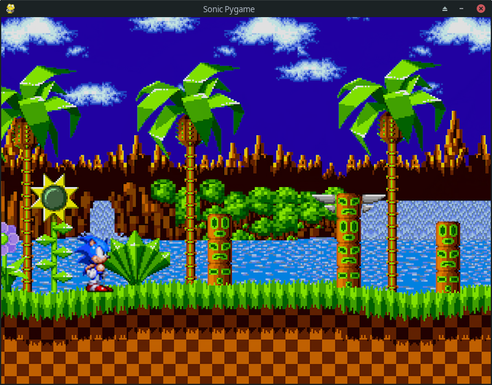
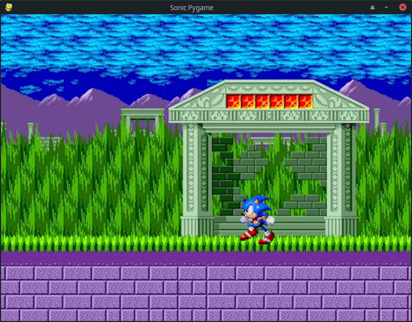

# Sonic made with [PyGame](https://www.pygame.org)

This is a simple example what [PyGame](https://www.pygame.org) can do. To see more, get the official [PyGame](https://www.pygame.org) news [here](https://www.pygame.org).

### Dependencies

Please, verify that you have **Virtualenv** and **PyPIenv** installed.

- [Python](https://www.python.org) (3.8)
- [PyGame](https://www.pygame.org) (1.9.6)
- PySimpleGUI

### Running

    $ git clone https://github.com/yoyomonem/sonic-pygame.git
    $ cd sonic-pygame

If you have **Virtualenv** and **PyPIenv** installed, you can type:
    
    $ pipenv install
    $ pipenv run sonic

However, if you don't have **Virtualenv** and **PyPIenv** installed, you can type only:

    $ python3 sonic/sonic_start.py

### Screenshots

---

#### Cloned with Git by [@yoyomonem/Youssef Abdel Monem Elsayed Ahmed Nasr](https://github.com/yoyomonem)
